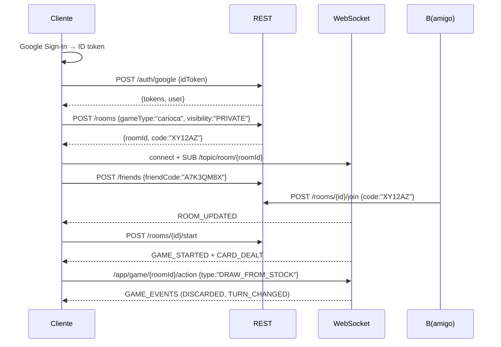

# API — Contrato de comunicación

> Fuente única de verdad para los payloads entre cliente y backend.
> **REST** para CRUD, **WebSocket/STOMP** para el estado en vivo.
> Seguridad: JWT en `Authorization: Bearer` (REST) y header STOMP.
> **Login obligatorio con Google OAuth 2.0** — `POST /auth/google` es el único
> endpoint público.
> Todos los payloads son **JSON**; base: `/api/v1`.

---

## 1. Convenciones generales

- Versionado por prefijo de URL: `/api/v1/`.
- Errores en formato uniforme:

```jsonc
{
  "code": "ROOM_NOT_FOUND",
  "message": "La sala no existe",
  "details": { "field": "..." },
  "requestId": "uuid"
}
```

- Paginación: `?page=&size=` → `{ items[], page, size, total }`.
- Fechas en **ISO-8601 UTC**.
- IDs: UUID (salas, usuarios, partidas). Códigos de amigo/sala: ver `SPECS §8.2`.

---

## 2. REST — Autenticación (Google OAuth 2.0)

**El login es obligatorio para jugar.** La única vía es Google OAuth 2.0. El
backend valida el **ID token** de Google (firma, `iss`, `aud`), crea/vincula la
cuenta local y emite sus propios JWTs de sesión.

| Método | Ruta | Descripción |
|---|---|---|
| POST | `/auth/google` | `{idToken}` → valida Google, login auto-registro, devuelve `{userId, tokens, user}` |
| POST | `/auth/relink` | **Autenticado.** `{idToken}` (nuevo Google) → revincula la cuenta (`ADR-016`); valida que el nuevo `sub` no esté en uso; revoca sesiones previas → `{userId, tokens, user}` |
| POST | `/auth/refresh` | `{refreshToken}` → `{tokens}` |
| POST | `/auth/logout` | Revoca refresh token actual (dispositivo) |
| POST | `/auth/logout-all` | Revoca todas las sesiones del usuario |
| DELETE | `/auth/account` | Baja de cuenta (borrado de datos) |

> **Revinculación:** `POST /auth/relink` exige sesión activa y un **ID token**
> nuevo (de la cuenta de Google a la que se quiere migrar). Respuestas de error:
> `401` sin sesión, `409 GOOGLE_ALREADY_LINKED` si ese Google ya pertenece a otra
> cuenta, `400` si el token es inválido. Tras revincular, el cliente **reinicia la
> sesión** (los tokens anteriores quedan revocados).

```jsonc
// POST /auth/google → 200
{
  "tokens": { "accessToken": "jwt (15 min)", "refreshToken": "jwt rotativo (7 días)" },
  "user": { "id": "uuid", "alias": "...", "avatarUrl": "...", "locale": "es" }
}
```

> No existe endpoint de registro con email/contraseña ni recuperación de clave:
> la identidad la gestiona Google.

## 3. REST — Usuario y amigos

| Método | Ruta | Descripción |
|---|---|---|
| GET | `/users/me` | Perfil propio |
| PATCH | `/users/me` | Editar alias/avatar/idioma |
| GET | `/users/me/friend-code` | Obtener código de amigo actual |
| POST | `/users/me/friend-code/regenerate` | Regenerar código (invalida anterior) |
| POST | `/friends/requests` | `{friendCode}` → envía **solicitud de amistad** (queda `PENDING`) |
| GET | `/friends/requests` | Lista de solicitudes **pendientes** de aceptar |
| POST | `/friends/requests/{requestId}/accept` | Aceptar solicitud → amistad activa (`ACCEPTED`) |
| POST | `/friends/requests/{requestId}/reject` | Rechazar solicitud |
| GET | `/friends` | Lista de amigos (solo `ACCEPTED`) + estado (online/en partida) |
| DELETE | `/friends/{friendId}` | Eliminar amistad. Efecto **en ambas direcciones**: los dos dejan de verse el estado online/en partida; se borra el vínculo y cualquier solicitud pendiente entre ambos. |

## 4. REST — Salas

| Método | Ruta | Descripción |
|---|---|---|
| POST | `/rooms` | Crear: `{gameType, visibility, maxPlayers, deckConfigId?, rulesetId?, password?}` → `{roomId, code}` |
| GET | `/rooms/{roomId}` | Estado de sala (jugadores, config, estado) |
| GET | `/rooms?visibility=public&gameType=` | Listar salas públicas |
| POST | `/rooms/{roomId}/join` | `{code?}` → unirse |
| POST | `/rooms/{roomId}/leave` | Salir de la sala |
| POST | `/rooms/{roomId}/ready` | Marcar listo / no listo |
| POST | `/rooms/{roomId}/kick` | Expulsar jugador (solo dueño) |
| POST | `/rooms/{roomId}/start` | Iniciar partida (solo dueño, jugadores listos suficientes) |
| POST | `/rooms/{roomId}/code/regenerate` | Regenerar código de sala (solo dueño) |
| GET | `/games/{roomId}/state` | Snapshot/resync del estado de la partida |

## 5. WebSocket / STOMP

- Conexión: `wss://host/ws` con token JWT (handshake).
- Formato de eventos (todos):

```jsonc
{
  "type": "GAME_EVENTS",
  "roomId": "uuid",
  "seq": 42,
  "payload": { "...": "según tipo" },
  "ts": "2026-08-04T10:00:00Z"
}
```

### 5.1 Tópicos de suscripción

| Suscripción | Eventos recibidos |
|---|---|
| `/topic/room/{roomId}` | `ROOM_UPDATED`, `PLAYER_JOINED`, `PLAYER_LEFT`, `PLAYER_READY`, `ROOM_CLOSED` |
| `/topic/game/{roomId}` | `GAME_STARTED`, `GAME_EVENTS`, `TURN_CHANGED`, `ROUND_END`, `GAME_END`, `PLAYER_DISCONNECTED`, `PLAYER_RECONNECTED`, `PLAYER_ABANDONED_ROUND`, `ABANDON_CONFIRMATION_REQUIRED`, `ACTION_REJECTED` |
| `/topic/chat/{roomId}` | `CHAT_MESSAGE`, `CHAT_SYSTEM` |

### 5.2 Destinos de envío (cliente → servidor)

| Destino | Payload |
|---|---|
| `/app/room/{roomId}/action` | `{type: READY | LEAVE | ...}` (solo dueño puede acciones de gestión por REST) |
| `/app/game/{roomId}/action` | `GameAction` (ver `docs/game-engine.md §5.1`) — incluye `SURRENDER` |
| `/app/game/{roomId}/confirm-abandon` | `{accepted: true|false}` confirmación de continuación tras abandono de ronda |
| `/app/game/{roomId}/reconnect` | `{lastSeq}` → resync |
| `/app/chat/{roomId}/message` | `{text}` |

> **Abandono de ronda:** `SURRENDER` (o **2 timeouts**) marca el abandono de la
> ronda actual; los demás confirman vía `confirm-abandon` si la partida continúa
> a la siguiente ronda. Ver `docs/game-engine.md §11.2`.

### 5.3 Tipos de eventos de juego

| Evento | Significado |
|---|---|
| `GAME_STARTED` | Config final de la partida, orden de asientos |
| `CARD_DEALT` | Cartas repartidas (cada jugador ve solo las suyas) |
| `STOCK_DRAWN` | Robó del pozo |
| `DISCARDED` | Carta descartada (visible) |
| `MELDED` | Bajó combinaciones a la mesa |
| `TURN_CHANGED` | `{playerId}` turno actual |
| `ACTION_REJECTED` | `{reason}` acción ilegal |
| `PLAYER_ABANDONED_ROUND` | `{playerId, reason: FORFEIT | TIMEOUT}` abandono de ronda actual |
| `ABANDON_CONFIRMATION_REQUIRED` | `{playerId, others}` pide confirmación a los demás para continuar |
| `ROUND_END` / `GAME_END` | `{reason: NORMAL | FORFEIT | TIMEOUT | ADMIN, result}` resultados y puntuación |
| `ROOM_CLOSED` | Sala cerrada tras el fin de la partida (recursos liberados) |

> **Información oculta:** el servidor **nunca** envía cartas de otros jugadores en
> `GAME_EVENTS`. Cada cliente recibe su proyección (`viewFor` en el motor).

### 5.4 Abandono de ronda (flujo Q9)

1. Jugador abandona (`SURRENDER`) o acumula **2 timeouts**.
2. Servidor emite `PLAYER_ABANDONED_ROUND` y `ABANDON_CONFIRMATION_REQUIRED`.
3. Los demás responden `/confirm-abandon`.
4. **Todos aceptan** → `ROUND_END` y la partida **continúa a la siguiente ronda
   sin el que abandona** (eventos de la nueva ronda normalmente).
5. **Alguien rechaza / no responde (timeout de confirmación)** → `GAME_END`
   con `reason: FORFEIT`.

---

## 6. Ejemplo de flujo completo



---

## 7. Versionado y evolución

- Cambios **no rupturistas** (nuevos campos): incrementar versión menor de API.
- Cambios **rupturistas**: `/api/v2/` y periodo de coexistencia.
- Todo evento nuevo documentado aquí antes de implementarse.
