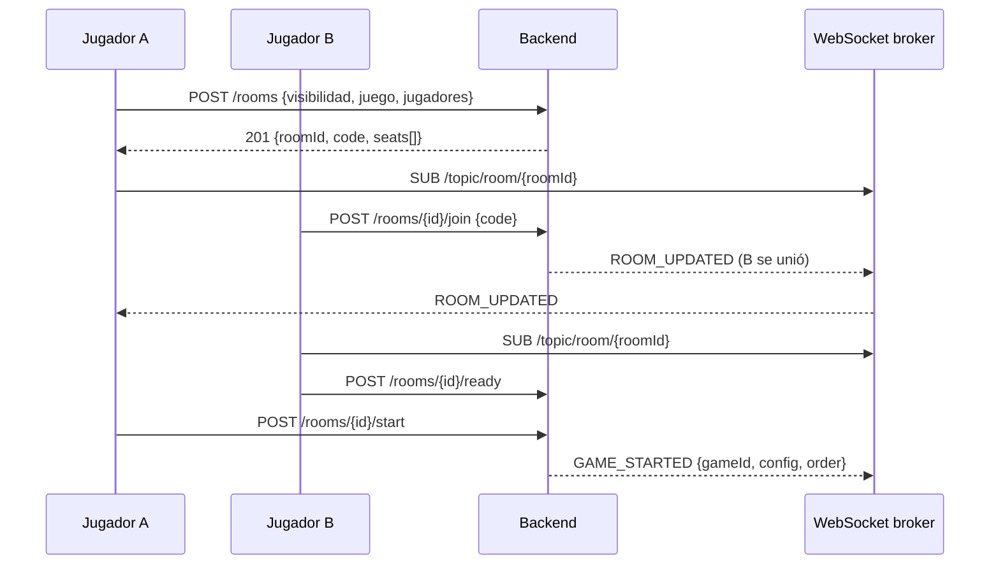
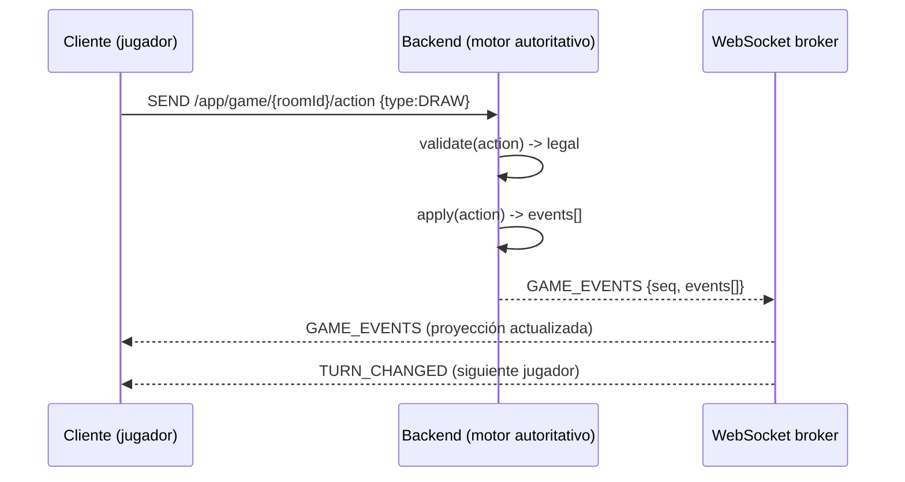

# Arquitectura de CARD_GAME

> Complementa a `SPECS.md` explicando **cómo** se organiza el sistema. Define
> capas, módulos, componentes y flujos clave. Asociado: `docs/adr.md`.

---

## 1. Visión general

Dos sistemas cooperando vía **REST** (operaciones CRUD) y **WebSocket/STOMP**
(estado en tiempo real):

```
┌────────────────────────────┐         REST/JSON          ┌─────────────────────────────┐
│   Android (Jetpack Compose) │ ────────────────────────► │          Backend (Java)      │
│   Clean Architecture + MVVM │ ◄──────────────────────── │   Spring Boot 3.x           │
│                             │     WebSocket/STOMP      │                             │
│   UI · Domain · Data        │                          │  Lobby · Auth · Friends     │
└────────────────────────────┘                          │  Game Engine · WebSocket   │
                                                          │  · Persistence · Redis     │
                                                          └──────────────┬──────────────┘
                                                                          │
                                                                ┌─────────▼─────────┐
                                                                │  PostgreSQL · Redis│
                                                                └───────────────────┘
```

**Principio rector:** el servidor es **autoritativo**. El cliente envía
*acciones* (intenciones) y recibe *eventos*; nunca decide resultados ni muta el
estado de juego localmente (solo proyecta vistas).

---

## 2. Arquitectura del cliente Android

### 2.1 Capas (Clean Architecture)

```
┌───────────────────────────────────────────────────────────────┐
│ PRESENTATION (Jetpack Compose)                                │
│   Screens · ViewModels · UiState (immutable) · Navigation      │
├───────────────────────────────────────────────────────────────┤
│ DOMAIN                                                        │
│   UseCases · Entities · Game abstractions · Contracts          │
│   (sin dependencias de Android ni de frameworks)               │
├───────────────────────────────────────────────────────────────┤
│ DATA                                                          │
│   Repositories · Remote (REST + WebSocket) · Local (Room)      │
│   DTOs/Entities · Mappers · Caching · GoogleSignInClient       │
└───────────────────────────────────────────────────────────────┘
        Framework: Hilt (DI) · Coroutines/Flow · Retrofit · OkHttp
```

Reglas de dependencia: **siempre hacia adentro** (hacia Domain). `Domain` no
conoce `Data` ni `Presentation`.

### 2.1.1 Login obligatorio (Google Sign-In)

- La app arranca en la **pantalla de login**; sin sesión no hay navegación a
  amigos, salas ni partidas.
- Flujo: `GoogleSignInClient` → el usuario elige cuenta → la app obtiene el
  **ID token** → `POST /auth/google` en el backend → recibe los **JWT propios**.
- Los tokens se guardan de forma segura en el dispositivo (Android Keystore /
  EncryptedSharedPreferences, ver `docs/security.md`).
- Si el `accessToken` expira, se renueva con el `refreshToken` (flujo automático
  e invisible). Si el refresh falla (revocado), se vuelve al login.

### 2.2 Capa de tiempo real (cliente)

- El cliente **no ejecuta el motor** en modo online: mantiene una **proyección**
  del estado (GameViewState) actualizada por eventos STOMP.
- Cada evento lleva un **número de secuencia** para detectar huecos y pedir
  **resync** (`GET /games/{roomId}/state` o un tópico de snapshot).
- Reconexión: auto-reconnect de OkHttp + re-suscripción STOMP + resync.

### 2.3 UI — unidireccional data flow (UDF)

```
Evento/Intención de usuario → ViewModel (procesa UseCase) → UiState (inmutable) → Composable
        ↑                                                                        │
        └────────────────── UiState por StateFlow ───────────────────────────────┘
```

- Un solo `StateFlow<UiState>` por pantalla (sealed class para los estados).
- Sin lógica de negocio en composables.

### 2.4 Modo offline / bots (extensión)

`FR-JGO-08` permite ejecutar el mismo motor en el cliente para **modo práctica
vs. bots** sin red. El motor es agnóstico al transporte; el backend y el cliente
comparten el mismo *contrato de dominio* (los DTOs/eventos son el contrato).

---

## 3. Arquitectura del Backend

### 3.1 Módulos (Spring Boot)

```
┌───────────────────────────────────────────────────────────────────┐
│                    API Layer (Controllers / STOMP)                  │
│   AuthController · UserController · FriendController ·             │
│   RoomController · GameController · GameSocketHandler · Chat       │
│   AdminController · AdminGameController · AdminStatsController     │
├───────────────────────────────────────────────────────────────────┤
│                    Service Layer (casos de uso)                     │
│   AuthService · FriendService · LobbyService · GameService         │
│   ReconnectService · StatsService · ScoringService                 │
├───────────────────────────────────────────────────────────────────┤
│                    Domain / Game Engine (núcleo)                    │
│   Game interface · CariocaStrategy · RulesEngine · DeckFactory     │
│   TurnManager · GameStateMachine · EventStore · Validators         │
├───────────────────────────────────────────────────────────────────┤
│                    Persistence / Infraestructure                     │
│   Repositories (JPA) · EventStore · Redis · Kafka(?) · Flyway      │
└───────────────────────────────────────────────────────────────────┘
```

- **Spring Web** (REST), **Spring WebSocket + STOMP** (real-time).
- **Spring Data JPA** + PostgreSQL; **Redis** para sesiones, cache y rate-limit.
- **Spring Security + OAuth2 (Google)** para autenticar el login, y **JWT** propio
  para sesiones de la app.
- **Flyway** para migraciones versionadas de la base de datos.
- **Módulo de administración:** API `/admin/**` (REST) consumida por la **web de
  administración en Angular 22** (`docs/admin-web.md`); requiere rol `ADMIN` +
  JWT. Las métricas para el monitoreo provienen del propio backend (health,
  latencia, errores) y de las estadísticas agregadas desde `game_events`.

### 3.1.1 Autenticación con Google OAuth 2.0 (flujo)

```
Android (Google Sign-In)                    Backend (Spring Security)
────────────────────────                    ─────────────────────────
1. GoogleSignInClient → cuenta de Google
2. Obtiene ID token (Google)
3. POST /auth/google {idToken}
        ───────────────────────────────►
                                            4. Valida ID token:
                                               · firma contra Google JWKS
                                               · iss = accounts.google.com
                                               · aud = server_client_id
                                            5. Busca/crea cuenta local
                                               (subject "sub" de Google)
                                            6. Emite JWT propio:
                                               access (15 min) + refresh (7 días, rotativo)
        ◄───────────────────────────────
        {accessToken, refreshToken, user}
4. Usa accessToken en REST y WebSocket
```

- El cliente usa **Google Sign-In** (SDK de Google en Android) y **nunca** maneja
  credenciales de Google: solo obtiene y envía el **ID token**.
- El backend es un **OAuth2 Resource Server** para los ID tokens de Google y un
  **issuer propio** de JWTs de sesión.
- **Login obligatorio:** todos los endpoints de negocio exigen `Authorization:
  Bearer <accessToken>`; sin sesión no hay acceso a amigos, salas ni partidas.

### 3.2 Concurrencia y partidas en memoria

- Cada **partida activa** es una *instancia de motor* residente en memoria,
  gestionada por un `GameRegistry`/`GameManager` (singleton por nodo).
- Las acciones entran por un **executor por partida** (cola serializada) para
  evitar condiciones de carrera entre acciones concurrentes de un mismo juego.
- El **estado de la partida se persiste como eventos + snapshot** periódico
  (`EventStore`). En caso de caída/reparticionado, se reconstruye desde el snapshot.
- **Ciclo de vida y limpieza:** al terminar (fin de rondas, **abandono del
  jugador**, timeout o admin) la partida persiste su estado final, cancela
  timers, cierra su executor y **se elimina del `GameRegistry`** para que el GC
  libere la memoria. Sin partidas "zombie" (`docs/game-engine.md §11`).

### 3.3 Escalado horizontal (diseño)

- Las salas/partidas se pueden **particionar por hash de roomId** (sticky
  routing) para escalar con más nodos. En MVP basta 1 nodo, pero el diseño no lo
  bloquea.
- Estado transitorio en **Redis** para permitir failover simple (COULD).

---

## 4. Diagramas de secuencia clave

### 4.1 Crear sala y unirse



### 4.2 Turno de juego



> **Anti-trampa:** cualquier acción ilegal devuelve `ACTION_REJECTED` con motivo;
> se loguea y se puede **expulsar** por reincidencia.

---

## 5. Decisiones de infraestructura (base)

| Aspecto | Decisión | Justificación |
|---|---|---|
| Servidor | Docker + Docker Compose (1 nodo MVP) | Reproducible, portable |
| Reverse proxy | Nginx/Traefik (TLS) | TLS/WSS terminación |
| BD | PostgreSQL 15+ | Relacional, transacciones |
| Cache/sesiones | Redis 7 | Sesiones, rate-limit, cache |
| CI/CD | GitHub Actions | Lint, test, build, docker, deploy |
| Logs/métricas | SLF4J + Micrometer/Prometheus (COULD) | Observabilidad |

---

## 6. Paquetes/módulos propuestos

### Backend (Gradle multi-módulo) — `backend/`

```
backend/
├── api/                 # Controllers, STOMP handlers, DTOs
├── application/         # Casos de uso (services)
├── domain/
│   ├── core/            # Game, GameEvent, Card, Deck, Turn, ...
│   ├── rules/           # Ruleset, validadores
│   └── games/carioca/   # CariocaStrategy (solo esto cambia por juego)
├── infrastructure/      # JPA repos, EventStore, Redis, WebSocket config
└── bootstrap/           # main(), Spring Boot app
```

### Android (Gradle multi-módulo) — `frontend/movil/`

```
frontend/movil/
├── app/                 # Navegación, DI, Application
├── core/                # Tema, red, WebSocket, cache, utilidades
├── domain/              # Motor y UseCases del juego (Kotlin puro, compartible con backend)
├── features/
│   ├── auth/
│   ├── friends/
│   ├── lobby/           # salas
│   └── game/            # tablero de juego (Carioca)
```

> Detalle de `core/` (módulo Android) y `domain/` (Kotlin/JVM puro) en
> `docs/best-practices.md`; el contrato de eventos compartido en `docs/api.md`.

### Compatibilidad Android (minSdk 29 — Android 10)

La app apunta a **Android 10+ (API 29)**, `targetSdk 36`. Requisitos y cambios
de API a partir de Android 10 que afectan a las funcionalidades planificadas:

| API (versión) | Aspecto | Impacto en la app |
|---|---|---|
| 29 (Android 10) | **minSdk** | Tema oscuro (`isSystemInDarkTheme`), gestos, `enableEdgeToEdge` nativo. |
| 30 (Android 11) | Visibilidad de paquetes | `packageVisibility` limitada; no afecta a Google Sign-In ni WebSocket. |
| 31 (Android 12) | **Splash Screen** | Uso de `androidx.core:core-splashscreen` (`installSplashScreen`) para una splash consistente; el sistema fuerza la suya si no. |
| 31 (Android 12) | Dynamic color | Condicional (`SDK_INT >= S`) en `CardTheme`. |
| 33 (Android 13) | **`POST_NOTIFICATIONS`** | Pedir en runtime antes de notificaciones de turno/eventos de partida (COULD). |
| 34 (Android 14) | **Foreground services tipados** | Si el WebSocket corre en segundo plano: `FOREGROUND_SERVICE_DATA_SYNC` + `android:foregroundServiceType`, y permiso `FOREGROUND_SERVICE` (API 28+) y `FOREGROUND_SERVICE_DATA_SYNC` (API 34+). |
| 35 (Android 15) | **Edge-to-edge obligatorio** | `enableEdgeToEdge()` + insets (`WindowInsets`) con `Scaffold`; la app ya lo usa desde la base. |
| 35 (Android 15) | 16 KB page size | Verificar tamaño de páginas del APK (`.so` alineados) al empaquetar. |
| 36 (Android 16) | `targetSdk 36` | Comportamientos de `targetSdk` 36: cambios de gestos/back (predictive back opt-in) y permisos parciales; validar en CI con API 36. |

Notas de implementación:

- **`minSdk 29`, `targetSdk 36`**, Java/Kotlin target **11** en todos los módulos.
- **Splash:** `Theme.Card.Starting` (parent `Theme.SplashScreen`) + `postSplashScreenTheme`.
- **Vincular Google (`FR-AUT-08`):** `play-services-auth` soporta API 29+; el flujo
  de relink no usa APIs nuevas.
- **WebSocket/STOMP:** librería estándar OkHttp/Spring; sin dependencia de API.
- **Tokens:** almacenamiento seguro del JWT propio (EncryptedSharedPreferences o
  DataStore cifrado); sin APIs versionadas.

### Web de administración (Angular 22) — `frontend/web/`

```
frontend/web/
├── src/app/
│   ├── core/            # AuthService (Google OAuth + JWT), guards, interceptores
│   ├── shared/          # UI reutilizable
│   ├── features/        # dashboard · games · users · stats · notices · audit
│   └── login/           # Login con Google
└── environments/        # Config por entorno
```

> Detalle en `docs/admin-web.md`. Es una **SPA solo-administrador** que consume
> `/admin/**` del backend; el jugador nunca la ve.

> El **contrato de eventos** (payloads del WebSocket y DTOs de dominio) debe
> definirse una vez y **documentarse** en `docs/api.md`, y compartirse entre
> cliente y servidor como fuente única de verdad.

---

## 7. Criterios de validación de la arquitectura

- [ ] El motor puede correr en backend **y** en cliente (misma lógica) — `FR-JGO-08`.
- [ ] Añadir un juego nuevo no modifica `domain/core` (solo `domain/games/*` + config).
- [ ] Un corte de red del jugador no rompe la partida (resync).
- [ ] Escala de 1 nodo a N sin reescribir el motor.
