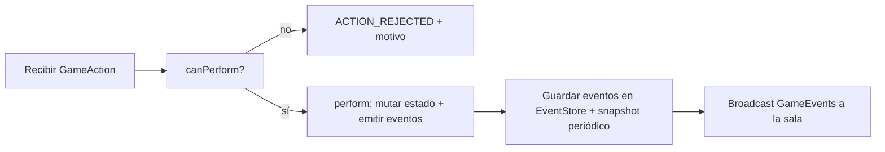

# Motor de juego genérico (Game Engine)

> Diseño del núcleo que ejecuta **cualquier** juego de naipes con la misma baraja.
> Carioca es solo una **estrategia registrada**. Objetivos: reutilización,
> testabilidad y extensibilidad. Requisitos de referencia: `SPECS.md §6.4`.

---

## 1. Principios de diseño

1. **Reglas como datos, no como código de flujo.** El motor ejecuta estados,
   turnos y acciones; los *rulesets* (configuración de reglas) describen qué es
   legal. Un ruleset es un objeto de configuración (definido en Java, cargado de
   BD/JSON) validado al inicio.
2. **Servidor autoritativo.** `apply(action)` valida contra el estado actual.
   Cero confianza en el cliente.
3. **Cada acción produce eventos.** El estado actual es una **proyección** de los
   eventos (`event sourcing`), con **snapshots** para eficiencia.
4. **Abstracciones mínimas y SOLID.** Interfaces pequeñas; composición sobre
   herencia; inyección de dependencias en lugar de new.
5. **Agnóstico al transporte.** El motor es una librería pura de dominio: no
   sabe de HTTP, STOMP ni Android.

---

## 2. Modelo de dominio (core)

### 2.1 Entidades de la baraja

```
Rank    (enum/config): 2..9, 10, J, Q, K, A   → valor ordinal para comparaciones
Suit    (enum/config): HEART, SPADE, DIAMOND, CLUB
Color   (config): RED→{HEART,DIAMOND}, BLACK→{SPADE,CLUB}  (mapeo configurable)
Card    (record):  id, setIndex, color?, suit?, rank?, jokerId?
Deck    : cartas de un set (mazo estándar)
Shoe    : N juegos + jokers → pila de reparto
DeckFactory (Builder): construye Shoe a partir de una DeckConfig
```

- `DeckConfig` es inmutable y serializable (para persistir/transferir).
- El **ID de carta** es único por partida (`setIndex + suit + rank` o `jokerId`).

### 2.2 Estructura de una partida

```
GameSession
 ├── gameType            (id del juego: "carioca", ...)
 ├── deckConfig          (Shue configurado)
 ├── rulesetId           (config de reglas específica del juego)
 ├── seats[]             (players + estado)
 ├── state               (máquina de estados)
 ├── eventLog[]          (event sourcing)
 └── snapshot            (última proyección persistida)
```

---

## 3. Abstracción de juego (Strategy + Factory + Registry)

```java
public interface Game {
    GameType type();
    GameState initialState(GameContext ctx);
    // precondiciones de jugabilidad por acción
    ValidationResult canPerform(GameState s, PlayerId p, GameAction a);
    // aplica la acción legal → devuelve eventos
    List<GameEvent> perform(GameState s, PlayerId p, GameAction a);
    // resumen/resultado al terminar
    GameResult resolve(GameState s);
    // proyección para el cliente (sin información oculta si corresponde)
    GameView viewFor(GameState s, PlayerId viewer);
}
```

- `GameRegistry`: registra instancias por `GameType` (**Factory** de juegos).
- `CariocaGame implements Game`: solo este archivo + su `Ruleset` cambian cuando
  se agrega un juego.
- El flujo común (reparto, turnos, persistencias, eventos) vive en el **core** y
  es compartido; el juego define las reglas específicas (Template Method donde
  haya pasos comunes).

### 3.1 Flujo genérico de una acción



---

## 4. Máquina de estados

El estado de una partida es una **máquina de estados** (State pattern):

```
PREPARING → DEALING → PLAYING → ROUND_END → GAME_END
              │          │          │          ▲
              └─(draw) ──┘    (siguiente ronda) │
                         (abandono/timeout/caída)┘
```

- Cada transición se valida con **guardas** definidas por el juego.
- Los eventos registran la transición (`STATE_CHANGED {from,to,reason}`).
- **`GAME_END` es terminal y siempre libera recursos** (§11). Se alcanza por:
  - fin normal de la última ronda (ganador),
  - **abandono no confirmado** (`SURRENDER` sin confirmación de los demás, §11.2),
  - política de timeout/caída configurada como "terminar partida",
  - administración/servidor (interrupción controlada).
- El abandono de una **ronda** (confirmado) **no** termina la partida: pasa a la
  **siguiente ronda** sin el jugador (§11.2).
- Estados inválidos **no son alcanzables**: el motor lo garantiza por diseño
  (las transiciones solo las dispara `perform()` legal).

---

## 5. Acciones y eventos (Command + Event Sourcing)

### 5.1 Acción (intención del cliente)

```
GameAction { type, playerId, targetCardIds[], targetGroupIds[], payload }
```

Ejemplos Carioca: `DRAW_FROM_STOCK`, `DRAW_FROM_DISCARD`, `MELD_GROUPS`,
`MELD_AND_DISCARD`, `DECLARE_ROUND`, `LAY_OFF`, `PASS`.

**Acción genérica del motor (todos los juegos):**

```
SURRENDER { playerId, reason? }   → abandona la ronda actual; los demás confirman si la partida continúa (§11.2)
```

- Disponible para el jugador en **cualquier estado jugable** (incluso fuera de su
  turno, con confirmación en UI).
- Requiere **confirmación explícita** del jugador (evita abandonos accidentales).
- **No es irreversible por sí solo**: los demás jugadores deciden si la partida
  continúa a la siguiente ronda sin el que abandona o si termina (`GAME_END`).
- **2 timeouts** equivale a `SURRENDER` (§6).

### 5.2 Evento (hecho consumado, emitido por el servidor)

```
GameEvent { seq, gameId, type, actor, payload, createdAt }
```

Ejemplos: `CARD_DEALT`, `STOCK_DRAWN`, `DISCARDED`, `MELDED`, `TURN_CHANGED`,
`ROUND_END`, `GAME_END`, `PLAYER_DISCONNECTED`.

Eventos de fin de partida:

```
PLAYER_ABANDONED_ROUND { playerId, reason: FORFEIT | TIMEOUT }   → abandono de la ronda actual
GAME_END { reason: NORMAL | FORFEIT | TIMEOUT | ADMIN, result: GameResult }
```

- **Invariante:** el estado actual = `fold(eventLog)`; el `seq` garantiza orden.
- **Replay:** reconstruir estado desde el último snapshot + eventos posteriores.

---

## 6. Turnos y temporizadores

- `TurnManager`: define el orden (config del juego: sentido, saltos, equipos).
- Cada juego decide el **siguiente turno** tras una acción (Template Method).
- **Timeout de jugador** (`FR-CAR-15` / `NFR-AVAIL-05`): política por ruleset.
  Carioca: si el jugador **no elige a tiempo, el motor juega aleatorio** por él;
  al acumular **2 timeouts** la partida lo trata como **abandono** (§11.2).
- Los timers son **por partida** (executor aislado), se cancelan al terminar.

---

## 7. Barajado determinista y seguro

- **Fisher-Yates con semilla**: `seed` generada por criptográfico en el servidor
  y persistida (auditoría/replay). Mismo seed + misma lógica = misma secuencia.
- La semilla **no se revela al cliente** hasta el final (anti-trampa).
- En el cliente (modo bot), la semilla local puede ser aleatoria.

---

## 8. Scoring (Strategy)

- `ScoringStrategy` por juego/ruleset: cómo contar puntos, cuándo termina,
  desempates.
- Carioca: puntos = cartas no bajadas al terminar la ronda; acumulativo.
- El resumen (`GameResult`) se persiste para historial y estadísticas.

---

## 9. Reglas como configuración (Ruleset)

El `Ruleset` es **datos** (JSON/BD) que el motor valida y consume:

```jsonc
{
  "gameType": "carioca",
  "deckConfigId": "english-2decks-2colors-4jokers",
  "deckSets": "FIXED_2",                    // siempre 2 juegos (108) para 2, 3 o 4 jugadores
  "handSize": 12,
  "maxPlayers": {"min": 2, "max": 4},       // Carioca: de 2 a 4 como máximo (FR-CAR-14 / ADR-009)
  "dealOrder": "COUNTER_CLOCKWISE",         // repartidor último
  "rounds": [                               // catálogo completo (9 base + opcionales)
    {"id":1, "combos":[{"type":"TRIPLE","count":2}]},
    {"id":2, "combos":[{"type":"TRIPLE","count":1},{"type":"RUN","count":1,"minLength":4}]},
    {"id":3, "combos":[{"type":"RUN","count":2,"minLength":4}]},
    {"id":4, "combos":[{"type":"TRIPLE","count":3}]},
    {"id":5, "combos":[{"type":"TRIPLE","count":2},{"type":"RUN","count":1,"minLength":4}]},
    {"id":6, "combos":[{"type":"TRIPLE","count":1},{"type":"RUN","count":2,"minLength":4}]},
    {"id":7, "combos":[{"type":"RUN","count":3,"minLength":4}]},
    {"id":8, "combos":[{"type":"TRIPLE","count":4}]},
    {"id":9, "combos":[{"type":"RUN","count":1,"length":13,"singleSuit":true}]}  // Escala Real
  ],
  "runRules": {"wraparound": true, "sameSuit": true, "aceLowAndHigh": true},
  "jokerRules": {
    "maxPerMeld": 1,
    "jokersNotAdjacent": true,
    "maxPerHand": 2,
    "cannotDiscard": true,
    "standalone": false
  },
  "layOff": {"onlyAfterMeldInPreviousRound": true},
  "timeout": {"policy": "PLAY_RANDOM", "seconds": 60, "limit": 2},  // 2 timeouts → abandono (FR-CAR-15)
  "abandon": {"onRound": true, "continueAfterConfirm": true},      // abandono de ronda con confirmación (FR-CAR-13)
  "scoring": {"perCard": {"J":10,"Q":10,"K":10,"A":20,"joker":30,"number":"value"},
              "winner": 0, "cutBonus": 0, "tieBreak": "mostRoundsWon",   // cutBonus 0 = estándar; variante −10 activable (ADR-018)
              "forfeitPenalty": "configurable"}
}
```

- La **selección de rondas de la sala** (`roomConfig.rounds`) filtra el
  `rounds` del ruleset: la partida se juega **solo con las rondas elegidas**
  (FR-CAR-05 / ADR-011).
- La **selección de variantes** (`roomConfig.variants`: comodines rojos, −10 por
  corte, jokers reciclables…) activa flags del ruleset; por defecto **ninguna**
  está activa (Carioca estándar, `ADR-017`/`ADR-018`).

- Un **Validador de Ruleset** rechaza configs inválidas al crear la partida
  (p. ej. `jokerRules.standalone` inconsistente, rondas mal formadas).
- Cambiar reglas = nueva versión de ruleset (versionada), sin tocar código.
- Los **tests del motor** se escriben contra rulesets fijos (fixtures).

---

## 10. Anti-trampa integrado (resumen)

- Acciones validadas contra el estado real del servidor.
- Cartas ocultas nunca se envían al cliente que no corresponde (`viewFor`).
- Semilla de barajado oculta hasta el final.
- Eventos firmados/verificados por `seq`; detectar acciones duplicadas/fuera de
  turno → `ACTION_REJECTED`.
- Detalle en `docs/security.md`.

---

## 11. Ciclo de vida de la partida y liberación de recursos

Una partida **debe terminar** (normal o por abandono) y **liberar todos los
recursos** que consume en el servidor. Objetivo: sin fugas de memoria ni
partidas "zombie".

### 11.1 Ciclo de vida

```
crear (GameRegistry) → repartir → jugar → GAME_END → persistir → limpiar → liberar
```

1. **Crear:** la partida se registra en `GameRegistry` con su executor propio.
2. **Ejecutar:** se procesan acciones de forma serializada por partida.
3. **Terminar** (`GAME_END`): se dispara por fin de las rondas configuradas,
   abandono **no confirmado**, o política de timeout/admin.
4. **Persistir:** se vuelca el **event log completo** + **snapshot final** y el
   `GameResult` (historial/estadísticas). Este paso es **síncrono y transaccional**
   antes de destruir el estado en memoria.
5. **Limpiar:**
   - Cancelar **todos los temporizadores** de turno/timeout pendientes.
   - **Shutdown del executor** de la partida (no acepta más tareas).
   - Cerrar/liberar los **canales WebSocket** de la sala (emitir `GAME_END` +
     `ROOM_CLOSED` y desuscribir).
   - **Quitar la partida del `GameRegistry`** (deja de ser referenciada → el GC
     puede liberar la memoria).
6. **Liberar:** la sala vuelve a estado `CLOSED`; los jugadores quedan en lobby.

### 11.2 Abandono de jugador (de ronda)

- **El jugador puede decidir no seguir jugando en cualquier momento**, con
  confirmación del propio jugador (evita abandonos accidentales).
- El abandono aplica a la **ronda actual** (evento `PLAYER_ABANDONED_ROUND`),
  no necesariamente a toda la partida:
  - **Continuación:** los demás jugadores **confirman si continúan a la
    siguiente ronda**. Si confirman, la partida **continúa a la siguiente ronda
    sin el que abandona** (conserva sus puntos acumulados). Si no confirman,
    la partida **termina** (`GAME_END`, motivo `FORFEIT`).
- **Timeout:** con **2 timeouts** el jugador se trata como abandono (misma
  política de §11.2, `FR-CAR-15`).
- **Resultado:** quien abandona se registra como `ABANDONED` y recibe una
  **penalización configurable** por ruleset (`scoring.forfeitPenalty`).
- No se reemplaza por un bot en la ronda abandonada; la continuación es con los
  jugadores restantes.
- Si el jugador abandona y luego se desconecta antes de la confirmación, la caída
  se maneja por la política de timeout (§6).

### 11.3 Anti-"zombies" (protección de recursos)

- **Idle timeout de partida:** si no hay acciones en N minutos, se fuerza
  `GAME_END` (razón `TIMEOUT`).
- **Sala vacía:** si se van todos los jugadores, la sala **caduca** y la partida
  se termina/libera (`FR-SAL-07`).
- **Monitor de registro:** `GameRegistry` expone métricas de partidas activas
  para detectar fugas (partidas que no se liberan).
- **Reinicio del servidor:** al arrancar, las partidas no retomadas desde
  snapshot se cierran/archivan (reanudar es COULD).

### 11.4 Contrato de limpieza (checklist de implementación)

- [ ] `Game.dispose()` cancela timers y cierra el executor.
- [ ] El event log y snapshot final se persisten **antes** de liberar.
- [ ] `GameRegistry.remove(gameId)` siempre se invoca al terminar.
- [ ] No quedan referencias circulares que impidan el GC (eventos/payloads
      anclados a instancias).
- [ ] Métrica de "partidas activas" disponible en producción.

---

## 12. Extensibilidad — cómo agregar un juego nuevo

> **Guía paso a paso completa en [`docs/adding-a-game.md`](adding-a-game.md).**

1. Definir `Ruleset` (config, incluye `maxPlayers` del juego) y validarla.
2. Crear `XGame implements Game` en `domain/games/<x>/` (solo reglas).
3. Registrar en `GameRegistry`.
4. Definir la **proyección UI** en el cliente (`GameView` → Composable).
5. No se modifica `core` (salvo hallazgo de un vacío de abstracción → ADR).

> Validación de límites: cada ruleset declara `maxPlayers` (Carioca = 4); el
> motor y la sala lo validan (no se aceptan más jugadores de los permitidos).

## 13. Criterios de aceptación del motor

- [ ] Un juego nuevo se agrega sin tocar `core` (probar con un juego de prueba).
- [ ] El motor corre en backend y cliente (misma librería de dominio).
- [ ] Toda acción ilegal es rechazada con motivo.
- [ ] Replay reproduce exactamente la partida.
- [ ] Timeout/reconexión no rompen la secuencia de eventos.
- [ ] **Timeout:** el jugador inactivo se juega **aleatorio**; con **2 timeouts**
      se trata como abandono (`FR-CAR-15`).
- [ ] **Abandono de ronda:** con confirmación de los demás, la partida **continúa
      a la siguiente ronda sin el que abandona**; sin confirmación, termina.
- [ ] **Una partida que termina libera recursos** (timer cancelados, executor
      cerrado, partida fuera del registro, sin "zombies").
